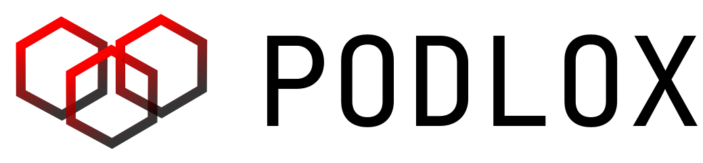
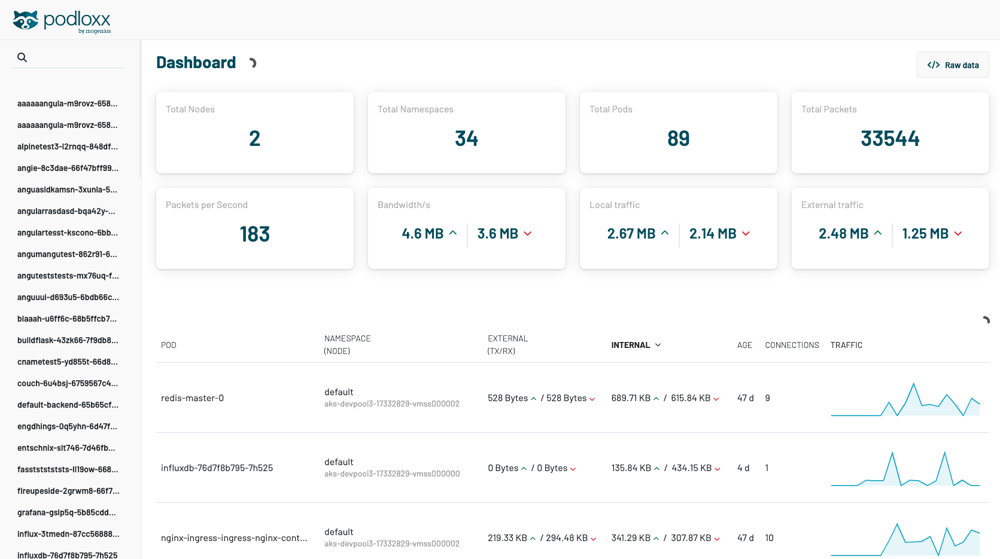

<p align="center">
  
</p>

# podloxx: Skinny Kubernetes Traffic Viewer<br /> (including local traffic)

<p align="center">
    <a href="https://github.com/mogenius/podloxx/blob/main/LICENSE">
        
    </a>
    <a href="https://github.com/mogenius/podloxx/releases/latest">
        
    </a>
    <a href="https://github.com/mogenius/podloxx/releases">
      
    </a>
    <a href="https://github.com/mogenius/podloxx">
      
    </a>
    <a href="https://discord.gg/WSxnFHr4qm">
      
    </a>
</p>

<p align="center">
  
</p>
<br />
<br />

# Table of contents
- [What is podloxx?](#what-is-podloxx)
- [Installation](#installation)
- [How does it work? What does it do?](#how-does-it-work-what-does-it-do)
- [Configuration](#configuration)
- [API](#api)
- [Roadmap](#roadmap)
- [Known Issues](#known-issues)
- [Credits](#credits)

# What is podloxx?
Podloxx is a leight-weight Kubernetes traffic monitoring tool that can be deployed as daemonset in every cluster. Local and external traffic is monitored in real time and can be viewed through a simple web interface. This allows identification of high traffic applications, understanding container relations and optimizing Kubernetes setups. Even works with slim containers 🙃

# Installation
Just download it and run it. Don't forget to set the right cluster using kubectx or whatever tool you prefer.

## Mac
```
curl -Lo podloxx https://github.com/mogenius/podloxx/releases/download/v1.0.11/podloxx-1.0.11-darwin-arm64 && chmod 755 podloxx

./podloxx start
```
## Linux
```
curl -Lo podloxx https://github.com/mogenius/podloxx/releases/download/v1.0.11/podloxx-1.0.11-linux-amd64 && chmod 755 podloxx

./podloxx start
```
## Windows
```
curl -Lo podloxx https://github.com/mogenius/podloxx/releases/download/v1.0.11/podloxx-1.0.11-win-amd64 && chmod 755 podloxx

./podloxx start
```

⚠️ ⚠️ ⚠️ IMPORTANT: be sure to select the right context before running podloxx ⚠️⚠️⚠️
```
./podloxx start
```

# How does Podloxx work?
Podloxx will run a series of tasks in order to run within your cluster. Here's what happens in detail once you launch Podloxx:
1. A Podloxx namespace is created to isolate it from other workloads.
2. Set up RBAC for proper access control.
3. Start a memory-only redis. All DaemonSets will drop their data here.
4. Create a DaemonSet to scrape data from all nodes.
5. Launch a redis service to make the redis accessible via port forwarding.
6. Set up port forwarding for the redis service.
7. Start a web service locally to expose the Podloxx web application (which gathers the data from redis).
8. Launch the web application in a browser.

In other words: The DaemonSet will inspect all packages of the node (using special deployment capabilities). The data will be captured, summarized and sent to the redis (using certain thresholds). The local web app will gather the data from the redis periodically and display the data inside the web application.

As soon as you close the cli app (CTRL + C) the application will be removed from your cluster and the UI will stop receiving updates. When you restart it, it will resume gathering data without storing a state (meaning you start from 0). 

To completely remove Podloxx from your cluster run:
```
./podloxx clean
```

# Configuration
To support multiple CNI configurations we provide a parameter for setup "--interface-prefix"
```
podloxx start --interface-prefix azv|veth|cali|e
```

| Provider      | CNI         | Prefix    | Tested|
| ------------- |:----------- |:---------:| -----:|
| Azure         | Azure CNI   |       azv |    👍 |
| Azure         | -           |      veth |    👍 |
| Azure         | Calico      |      cali |    👍 |
| AWS           | CNI         |       eni |    👍 |
| AWS           | -           |       - |      ❓ |
| AWS           | Calico      |       - |      ❓ |
| Google Cloud  | CNI         |       - |      ❓ |
| Google Cloud  | -           |       - |      ❓ |
| Google Cloud  | Calico      |       - |      ❓ |

If you have tested additional configurations: Let us know what works :-)

# API
You can use following API endpoints to access the raw data:
```
http://127.0.0.1:1337/traffic/overview
http://127.0.0.1:1337/traffic/total
http://127.0.0.1:1337/traffic/flow
```

# Roadmap
XXX 

# Known Issues
- Sometimes port forwarding doesn't get established and Podloxx doesn't recognize it.
- Depending on your cloud provider your INTERFACE_PREFIX might be different. If you encounter a different interface please report its name to us so we can improve the list above.

# Credits 
We took great inspiration (and some lines of code) from [Mizu](https://github.com/up9inc/mizu).</br>
Awesome work from the folks at [UP9](https://up9.com/).</br>
Notice: The project has been renamed to Kubeshark and moved to https://github.com/kubeshark/kubeshark.</br>
# API
TODO

# Roadmap
TODO 

# Known Issues
TODO

# Thanks 
We took great inspiration (and some lines of code) from [Mizu](https://github.com/up9inc/mizu). Awesome work from the folks at [UP9](https://up9.com/).

# About mogenius
mogenius provides an automated cloud infrastructure that allows scaling applications on Kubernetes with a user friendly UI and API. 
